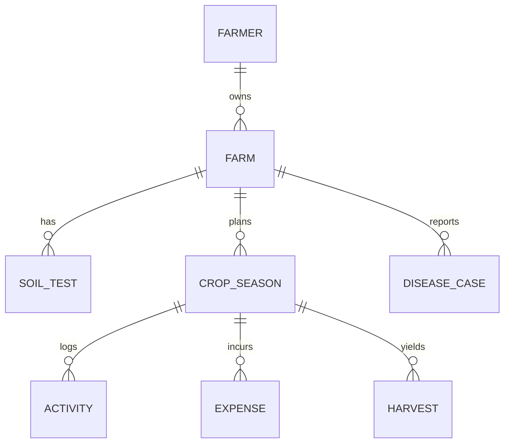

# Data model (implemented: Farmer, Farm, SoilTest; others planned)

```mermaid
erDiagram
  FARMER ||--o{ FARM : owns
  FARM ||--o{ SOIL_TEST : has
  FARM ||--o{ CROP_SEASON : plans
  CROP_SEASON ||--o{ ACTIVITY : logs
  CROP_SEASON ||--o{ EXPENSE : incurs
  CROP_SEASON ||--o{ HARVEST : yields
  FARM ||--o{ DISEASE_CASE : reports
```
Only FARMER, FARM, SOIL_TEST exist in code today.
