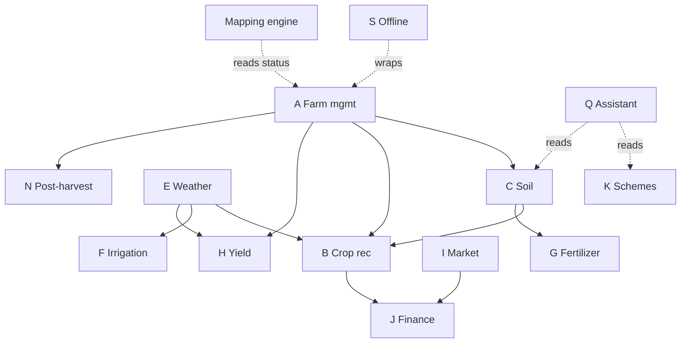

# Module dependencies

```mermaid
graph TD
  A[A Farm mgmt] --> C[C Soil]
  A --> B[B Crop rec]
  C --> B
  E[E Weather] --> B
  E --> F[F Irrigation]
  C --> G[G Fertilizer]
  B --> J[J Finance]
  I[I Market] --> J
  A --> H[H Yield]
  E --> H
  A --> N[N Post-harvest]
  Q[Q Assistant] -.reads.-> K[K Schemes]
  Q -.reads.-> C
  S[S Offline] -.wraps.-> A
  X[Mapping engine] -.reads status.-> A
```
